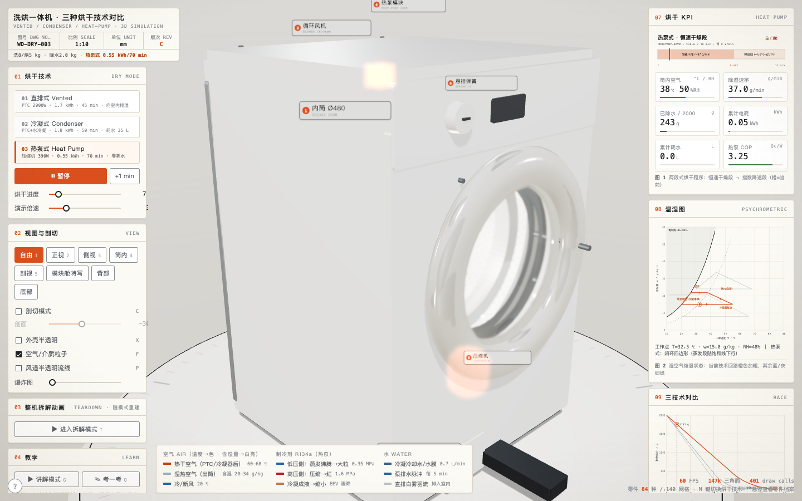
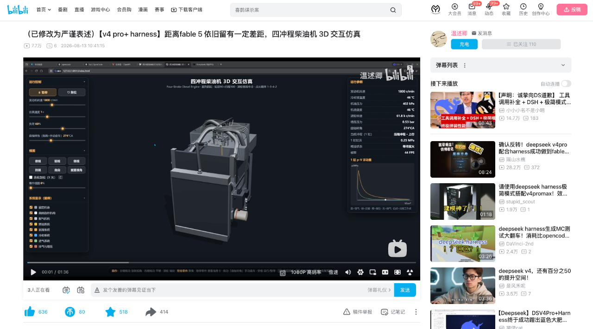

# 洗烘一体机三种烘干技术对比 / Washer-Dryer Drying Tech Comparator

[中文](#中文) · [English](#english)

**在线演示 / Live demo:** <https://washer.papertok.ai/>

**GitHub Pages 镜像 / Mirror:** <https://viffygwaanl.github.io/washer-dryer-compare/>



## 联系与关注 / Connect

欢迎扫码关注微信公众号，或添加个人微信。<br>
Scan the QR codes to follow the official account or add Gwaanl on WeChat.

| 微信公众号 / Official Account | 个人微信 / Personal WeChat |
|:---:|:---:|
|  |  |
| 微信扫码关注 Page & Pause<br>Scan with WeChat to follow Page & Pause | 微信扫码添加 Gwaanl<br>Scan with WeChat to add Gwaanl |

---

## 中文

### 项目简介

这是一个可离线运行的单文件 3D 交互页面，用统一工况对比洗烘一体机的三种烘干路线：**直排式、冷凝式和热泵式**。页面把设备结构、空气与介质回路、烘干过程以及关键指标放在同一个可操作场景中，帮助读者直观看懂三种方案“热量从哪里来、湿气到哪里去、能耗与耗水为何不同”。

### 主要功能

- 三种烘干技术一键切换，并同步显示对应结构与介质回路。
- 可视化热空气、湿空气、冷凝水和热泵制冷剂的流动路径。
- 实时显示温湿度、除湿速率、累计电耗、累计耗水和热泵 COP。
- 支持自由视角、预设镜头、剖切、外壳半透明、爆炸图和系统显隐。
- 提供 140 个可拾取零件与 84 条中英双语零件档案。
- 包含分站讲解、自动出题以及 22 步拆解/装配演示。
- Three.js r160 已内联，无运行时 CDN 依赖，下载后双击即可打开。

### 演示工况与数据边界

页面采用“洗涤容量 8 kg、烘干容量 5 kg、需除水 2.0 kg”的统一工况解释技术差异。能耗、耗水、时长和 COP 是该演示工况下的工程化比较值，并不代表所有品牌或机型。实际表现会随负载、初始含水率、环境温湿度、程序设定和硬件设计变化。

### 主要操作

- 鼠标左键旋转，右键平移，滚轮缩放，双击聚焦零件。
- `1`–`5` 切换视角，`C` 剖切，`X` 半透明，`F` 粒子，`P` 流线。
- `E` 爆炸图，`T` 拆解，`G` 讲解，`Q` 考一考，`H` 隐藏界面。
- 推荐使用桌面浏览器获得完整控制台和 3D 视野。

### 本地运行

无需构建或安装依赖，下载 `index.html` 后直接双击打开即可。也可以启动任意静态服务器：

```bash
python3 -m http.server 8000
```

然后访问 <http://localhost:8000/>。

### 灵感来源

本项目在交互表达和机械系统可视化方面的创作灵感，来自 B 站 UP 主温述卿展示的“四冲程柴油机 3D 交互仿真”。下图由项目维护者提供，用于记录和致谢这一灵感来源；本项目围绕洗烘一体机三种烘干路线独立制作。



> 图片与原视频内容版权归 Bilibili 及原作者所有；此处仅作来源说明与致谢。

### 技术与许可

项目由原生 HTML、CSS、JavaScript 和内联 Three.js r160 构成。项目源码以 [MIT License](LICENSE) 开源；Three.js 的版权与许可见 [THIRD_PARTY_NOTICES.md](THIRD_PARTY_NOTICES.md)。

---

## English

### Overview

This is an offline, single-file 3D experience that compares three washer-dryer technologies under one shared operating scenario: **vented drying, water-cooled condensing, and heat-pump drying**. It brings the machine structure, airflow and working-fluid circuits, drying process, and key performance indicators into one interactive scene, making it easier to understand where the heat comes from, where the moisture goes, and why energy and water use differ.

### Features

- Switch among all three drying technologies and reveal their corresponding components and fluid circuits.
- Visualize hot air, humid exhaust, condensate, and heat-pump refrigerant flow.
- Track temperature, relative humidity, moisture-removal rate, electricity use, water use, and heat-pump COP in real time.
- Explore preset cameras, section cuts, transparent housings, exploded views, and assembly visibility controls.
- Inspect 140 selectable parts backed by 84 bilingual Chinese-English component profiles.
- Follow guided learning stations, take automatically generated quizzes, and play a 22-step teardown or reassembly sequence.
- Run entirely offline: Three.js r160 is embedded and no runtime CDN is required.

### Scenario and data scope

The comparison uses a shared scenario of an 8 kg washing capacity, a 5 kg drying load, and 2.0 kg of water to remove. Energy, water, cycle time, and COP figures are engineering comparison values for this demonstration—not universal claims for every appliance. Real-world results vary with load size, initial moisture content, ambient conditions, program settings, and machine design.

### Controls

- Left-drag to orbit, right-drag to pan, use the wheel to zoom, and double-click to focus a part.
- Press `1`–`5` for camera presets, `C` for section cut, `X` for transparency, `F` for particles, and `P` for flow paths.
- Press `E` for the exploded view, `T` for teardown, `G` for the guided tour, `Q` for the quiz, and `H` to hide the interface.
- A desktop browser is recommended for the complete control panel and 3D viewport.

### Run locally

No build step or dependency installation is required. Download `index.html` and open it directly, or serve the directory with any static web server:

```bash
python3 -m http.server 8000
```

Then visit <http://localhost:8000/>.

### Inspiration and credit

The interaction and mechanical-visualization concept was inspired by a “Four-Stroke Diesel Engine 3D Interactive Simulation” shared by Bilibili creator Wenshuqing / 温述卿. The screenshot below was supplied by the project maintainer to document and credit that inspiration. This washer-dryer comparison was independently created around its own subject and engineering model.


> The screenshot and original video remain the property of Bilibili and their respective creator. They are included here solely for attribution and contextual reference.

### Technology and license

The project uses vanilla HTML, CSS, JavaScript, and an embedded copy of Three.js r160. The project source is released under the [MIT License](LICENSE). See [THIRD_PARTY_NOTICES.md](THIRD_PARTY_NOTICES.md) for the Three.js copyright and license notice.
